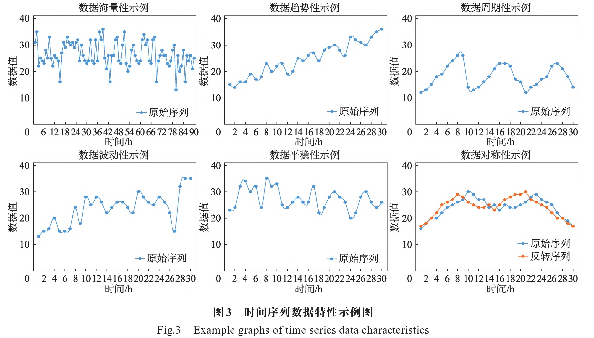

# 基本概念

**时间序列数据**：一系列以时间为序的观察值的集合

**问题数据**：缺失数据、噪音数据、异常数据

针对**问题数据**的一些解决方法：

1. 缺失数据：可以借助**深度学习**算法

2. 噪音数据：小波变换和经验模态分解

3. 异常数据：利用聚类等算法（我们的论文中有两篇文章提到其他更好的方法）

   

**时间序列数据特性**：

# Autoformer

背景：时间序列预测在能源消耗、交通和经济规划、天气和疾病传播预测等领域被广泛应用。在这些实际应用中，一个紧迫的需求是将预测时间延长到遥远的未来，这对于长期规划和早期预警非常有意义。然而，在长期设置下，预测任务非常具有挑战性。首先，直接从长期时间序列中发现时间依赖性是不可靠的，因为依赖关系可能被复杂的时间模式所遮蔽。其次，由于序列长度的二次复杂度，具有自注意机制的传统Transformer在长期预测方面具有计算上的限制。以往基于Transformer的预测模型主要集中在改进自注意力到稀疏版本上。虽然性能有了显著提升，但这些模型仍然利用**点对点**表示聚合。因此，在提高效率的过程中，它们会因为稀疏的**点对点**连接而牺牲信息利用率，从而在时间序列的长期预测中形成瓶颈。在此基础上，我们试图利用**序列周期性**来改进自注意力中的点对点连接。我们观察到，在相同周期中处于相同阶段位置的子序列通常呈现相似的时间过程。因此，我们尝试基于由序列周期性导出的过程相似性构建一个**序列级连接**。

Autoformer引入了一个自动相关机制来取代自注意力，该机制基于序列周期性发现子序列的相似性并从基础周期中聚合相似的子序列。

这些O($n\log n$)方法基于原始Transformer，并试图将自注意力机制改进为稀疏版本，仍然遵循点对点依赖性和聚合。在本文中，我们提出的自动相关机制基于时间序列的固有周期性，并且可以提供序列级连接。

### 中文翻译：

#### 1 Abstract & Introduction

这篇论文研究了时间序列的长期预测问题，指出了延长预测时间对于实际应用的重要性，如极端天气预警和长期能源消耗规划等。以前基于Transformer的模型采用各种自注意机制来发现长距离依赖关系。然而，复杂的长期未来时间序列模式阻碍了模型找到可靠的依赖关系。此外，为了处理长序列效率问题，Transformer不得不采用稀疏版本的点对点自注意力，导致信息利用瓶颈。为了超越Transformer，我们设计了Autoformer作为一种新颖的分解架构，具有自动相关机制。我们打破了序列分解的预处理惯例，将其改造为深度模型的基本内部块。这种设计赋予Autoformer对复杂时间序列的渐进分解能力。此外，受随机过程理论的启发，我们设计了基于序列周期性的自动相关机制，它在子序列级别进行依赖关系发现和表示聚合。自动相关机制在效率和准确性方面都优于自注意力。在长期预测方面，Autoformer具有最先进的准确性，在涵盖能源、交通、经济、天气和疾病等五个实际应用的六个基准上，相对提高了38%的准确性。代码可在该存储库中找到。

时间序列预测在能源消耗、交通和经济规划、天气和疾病传播预测等领域被广泛应用。在这些实际应用中，一个紧迫的需求是将预测时间延长到遥远的未来，这对于长期规划和早期预警非常有意义。因此，在这篇论文中，我们研究了时间序列的长期预测问题，其特点是预测时间序列的长度很大。最近的深度预测模型[41, 17, 20, 28, 23, 29, 19, 35]取得了巨大进展，特别是基于Transformer的模型。由于自注意机制的作用，Transformers在建模顺序数据的长期依赖关系方面具有很大优势，这使得更强大的大模型[7, 11]成为可能。然而，在长期设置下，预测任务非常具有挑战性。首先，直接从长期时间序列中发现时间依赖性是不可靠的，因为依赖关系可能被复杂的时间模式所遮蔽。其次，由于序列长度的二次复杂度，具有自注意机制的传统Transformer在长期预测方面具有计算上的限制。以往基于Transformer的预测模型[41, 17, 20]主要集中在改进自注意力到稀疏版本上。虽然性能有了显著提升，但这些模型仍然利用点对点表示聚合。因此，在提高效率的过程中，它们会因为稀疏的点对点连接而牺牲信息利用率，从而在时间序列的长期预测中形成瓶颈。

为了理解复杂的时间模式，我们尝试采用分解的思想，这是时间序列分析中的标准方法[1, 27]。它可以用于处理复杂的时间序列并提取更可预测的组件。然而，在预测环境下，它只能用作过去序列的预处理，因为未来是未知的[15]。这种常见用法限制了分解的能力，并忽视了分解组件之间潜在的未来交互作用。因此，我们尝试超越分解的预处理用途，并提出一种通用架构，赋予深度预测模型内在的渐进分解能力。此外，分解可以解开复杂的时间模式，并突显时间序列的固有属性[15]。**在此基础上，我们试图利用序列周期性来改进自注意力中的点对点连接**。我们观察到，在相同周期中处于相同阶段位置的子序列通常呈现相似的时间过程。因此，我们尝试基于由序列周期性导出的过程相似性构建一个序列级连接。

基于以上动机，我们提出了原创的Autoformer，代替了Transformer进行长期时间序列预测。Autoformer仍然遵循残差和编码器-解码器结构，但将Transformer改造成分解预测架构。通过将我们提出的分解块嵌入为内部操作符，Autoformer可以逐步将长期趋势信息从预测的隐藏变量中分离出来。这种设计允许我们的模型在预测过程中交替进行分解和优化中间结果。受到随机过程理论的启发[8, 24]，Autoformer引入了一个自动相关机制来取代自注意力，该机制基于序列周期性发现子序列的相似性并从基础周期中聚合相似的子序列。这种基于序列的机制实现了长度为L的序列的O(LlogL)复杂度，并通过将点对点表示聚合扩展到子序列级别打破了信息利用瓶颈。Autoformer在六个基准测试中实现了最先进的准确性。其贡献总结如下：

- 为了解决长期未来的复杂时间模式，我们提出了Autoformer作为一种分解架构，并设计了内部分解块，赋予深度预测模型内在的渐进分解能力。
- 我们提出了一种具有依赖关系发现和信息聚合功能的自动相关机制，该机制位于系列级别。我们的机制超越了以往的自注意力系列，并可以同时提高计算效率和信息利用率。
- 在长期设置下，Autoformer在六个基准测试中相对提高了38%的准确性，涵盖了能源、交通、经济、天气和疾病等五个实际应用。

#### 2 Realted Work

由于时间序列预测的巨大重要性，各种模型已经得到了很好的发展。许多时间序列预测方法起源于经典工具[32, 9]。ARIMA [6, 5]通过差分将非平稳过程转换为平稳过程来解决预测问题。滤波方法也被引入到序列预测中[18, 10]。此外，循环神经网络（RNNs）模型被用来模拟时间序列的时间依赖性[36, 26, 40, 22]。DeepAR [28]结合了自回归方法和RNNs来建模未来序列的概率分布。LSTNet [19]引入了卷积神经网络（CNNs）与循环跳跃连接，以捕捉短期和长期时间模式。基于注意力的RNNs [39, 30, 31]引入了时间注意力来探索预测的长距离依赖关系。此外，许多基于时间卷积网络（TCN）[34, 4, 3, 29]的工作试图用因果卷积来建模时间因果关系。这些深度预测模型主要集中在通过循环连接、时间注意力或因果卷积来建模时间关系。最近，基于自注意力机制的Transformer [35, 38]在顺序数据上展现了强大的能力，如自然语言处理 [11, 7]、音频处理 [14]甚至计算机视觉 [12, 21]。然而，将自注意力应用于长期时间序列预测是计算上具有挑战性的，因为序列长度L的二次复杂度在内存和时间上都是如此。LogTrans [20]引入了局部卷积到Transformer，并提出了LogSparse注意力来选择遵循指数增长间隔的时间步骤，将复杂度降低到O(L(logL)2)。Reformer [17]引入了局部敏感哈希（LSH）注意力，并将复杂度降低到O(LlogL)。Informer [41]通过KL散度基于ProbSparse注意力扩展了Transformer，并同样实现了O(LlogL)的复杂度。需要注意的是，这些方法基于原始Transformer，并试图将自注意力机制改进为稀疏版本，仍然遵循点对点依赖性和聚合。在本文中，我们提出的自动相关机制基于时间序列的固有周期性，并且可以提供序列级连接。

时间序列分解作为时间序列分析中的标准方法，将时间序列分解为几个组成部分，每个部分代表一种更可预测的基本模式类别之一。它主要用于探索随时间变化的历史变化。对于预测任务，分解通常用作预测未来系列之前历史系列的预处理，比如Prophet [33]使用趋势-季节性分解，N-BEATS [23]使用基础扩展，DeepGLO [29]使用矩阵分解等。然而，这种预处理受到历史序列的简单分解效果的限制，并忽视了长期未来中系列基本模式之间的层次交互。本文将分解思想从一个新的渐进维度进行了改进。我们的Autoformer将分解作为深度模型的内部块，可以逐步将隐藏系列分解到整个预测过程中，包括过去的系列和预测的中间结果。

#### 3 autoformer

时间序列预测问题是在给定过去长度为I的系列的情况下，预测未来长度为O的最有可能的系列，表示为输入-I-预测-O。长期预测设置是预测长期未来，即更大的O。如前所述，我们已经强调了长期系列预测的困难之处：处理复杂的时间模式和打破计算效率和信息利用的瓶颈。为了解决这两个挑战，我们将分解引入作为深度预测模型的内置块，并提出了Autoformer作为分解架构。此外，我们设计了自动相关机制来发现基于周期的依赖关系，并从基础周期中聚合相似的子序列。

 3.1 Decomposition Architecture

我们将Transformer [35]改造为一个深度分解架构（图1），包括内部系列分解块、自动相关机制以及相应的编码器和解码器。

**系列分解块**：为了在长期预测环境中学习复杂的时间模式，我们采用了分解的思想[1, 27]，它可以将系列分解为趋势-周期性部分和季节性部分。这两部分分别反映了系列的长期进展和季节性。然而，直接分解未来系列是不可实现的，因为未来是未知的。为了解决这个困境，我们将系列分解块作为Autoformer的内部操作（图1），它可以逐步从预测的中间隐藏变量中提取长期稳定的趋势。具体来说，我们采用移动平均来平滑周期性波动并突出长期趋势。对于长度为L的输入系列X，过程如下：
$$
X_t=AvgPool(Padding(X)) \\
X_s=X−X_t
$$
其中，$X_s$和$X_t$分别表示季节性和提取的趋势-周期性部分。我们采用AvgPool()进行移动平均，并使用填充操作以保持系列长度不变。我们使用 $𝑋𝑠,𝑋𝑡=SeriesDecomp(𝑋)$ 来总结以上方程，这是一个模型内部块。

**模型输入**：编码器部分的输入是过去I个时间步的Xen（长度为R(I d)）。作为一个分解架构（图1），Autoformer解码器的输入包括季节性部分Xdes（长度为R(I/2+O) d）和趋势-周期性部分Xdet（长度为R(I/2+O) d）需要进一步完善。每个初始化包括两个部分：从编码器输入的后半部分Xen中分解得到的组件，长度为I/2，提供最近的信息；长度为O的占位符，由标量填充。具体公式如下：
$$
X_{ens}, X_{ent} = \text{SeriesDecomp}(X_{en}[I/2:I]) \\
X_{des} = \text{Concat}(X_{ens}, X_{0}) \\
X_{det} = \text{Concat}(X_{ent}, X_{mean}) \\
$$

𝑋𝑒𝑛𝑠,𝑋𝑒𝑛𝑡 分别表示 𝑋𝑒𝑛 的季节性和趋势-周期性部分，长度为 𝑅𝐼2𝑑*X**e**n**s*​,*X**e**n**t*​ 分别表示 *X**e**n*​ 的季节性和趋势-周期性部分，长度为 2*R**I*​*d* 𝑋0,𝑋𝑚𝑒𝑎𝑛 分别表示用零和 𝑋𝑒𝑛 的均值填充的占位符，长度为 𝑅𝑂𝑑*X*0​,*Xmean*​ 分别表示用零和 *Xen*​ 的均值填充的占位符，长度为 *RO**d*

这些部分共同构成了Autoformer解码器的输入结构。

**编码器**：如图1所示，其重点在于对季节性部分进行建模。编码器的输出包含过去的季节性信息，并将用作交叉信息，帮助解码器优化预测结果。假设我们有N个编码器层。第l个编码器层的总方程可以总结为 𝑋𝑙,𝑒𝑛=Encoder(𝑋𝑙−1,𝑒𝑛)*X**l*,*e**n*=Encoder(*X**l*−1,*e**n*)。具体细节如下所示：
$$
S_{l1, en} = \text{SeriesDecompAuto-Correlation}(X_{l-1, en}) + X_{l-1, en} \\
 S_{l2, en} = \text{SeriesDecomp FeedForward}(S_{l1, en}) + S_{l1, en}
$$
其中，“_”表示消除的趋势部分。𝑋𝑙,𝑒𝑛=𝑆𝑙2,𝑒𝑛*X**l*,*e**n*=*S**l*2,*e**n* 表示第l层编码器的输出，𝑋0,𝑒𝑛*X*0,*e**n* 是嵌入的 𝑋𝑒𝑛*X**e**n*。 𝑆𝑙𝑖,𝑒𝑛*S**l**i*,*e**n* （i从1到N）表示第l层中第i个系列分解块后的季节性组件。在下一节中，我们将详细描述Auto-Correlation()，它可以无缝地替代自注意力。

**解码器**：解码器包含两部分：用于趋势-周期性组件的累积结构和用于季节性组件的堆叠自动相关机制（图1）。每个解码器层包含内部自动相关和编码器-解码器自动相关，分别用于优化预测和利用过去的季节性信息。请注意，模型会从解码器中间隐藏变量中提取潜在的趋势，允许Autoformer逐步优化趋势预测并消除周期性相关中的干扰信息。假设有M个解码器层。利用来自编码器的潜变量 𝑋𝑁,𝑒𝑛*X**N*,*e**n*，第l个解码器层的方程可以总结为 𝑋𝑙,𝑑𝑒=Decoder(𝑋𝑙−1,𝑑𝑒,𝑋𝑁,𝑒𝑛)*X**l*,*d**e*=Decoder(*X**l*−1,*d**e*,*X**N*,*e**n*)。解码器的形式化如下所示：

𝑋𝑙,𝑑𝑒=𝑆𝑙3,𝑑𝑒𝑙−1,𝑀*X**l*,*d**e*=*S**l*3,*d**e**l*−1,*M* 表示第l个解码器层的输出。𝑋0,𝑑𝑒*X*0,*d**e* 是从 𝑋𝑑𝑒𝑠*X**d**es* 提取的用于深度转换的嵌入，𝑇0,𝑑𝑒=𝑋𝑑𝑒𝑡*T*0,*d**e*=*X**d**e**t* 是用于累积的。𝑆𝑙𝑖,𝑑𝑒*S**l**i*,*d**e* 和 𝑇𝑙𝑖,𝑑𝑒*T**l**i*,*d**e* （i从1到3）分别表示第l层中第i个系列分解块后的季节性组件和趋势-周期性组件。𝑊𝑙𝑖*W**l**i* （i从1到3）表示第i个提取的趋势 𝑇𝑙𝑖,𝑑𝑒*T**l**i*,*d**e* 的投影器。

**自注意力机制**：自相关机制如图2所示，我们提出了一种基于序列的连接方式来扩展信息利用。自相关通过计算序列自相关来发现基于周期的依赖关系，并通过时间延迟聚合来聚合相似的子序列。基于周期的依赖关系观察到，在周期中同一相位位置自然地提供了相似的子过程。受到随机过程理论的启发，对于实际离散时间过程 𝑋𝑡*X**t*，我们可以通过以下方程获得自相关 𝑅𝑋𝑋(𝜏)*R**XX*(*τ*)：

𝑅𝑋𝑋(𝜏)=lim⁡𝐿→∞1𝐿∑𝑡=1𝐿𝑋𝑡𝑋𝑡+𝜏*R**XX*(*τ*)=lim*L*→∞*L*1∑*t*=1*L**X**t**X**t*+*τ*

其中，𝑅𝑋𝑋(𝜏)*R**XX*(*τ*) 反映了 𝑋𝑡*X**t* 与其滞后序列 𝑋𝑡+𝜏*X**t*+*τ* 之间的时间延迟相似性。如图2所示，我们使用自相关 𝑅(𝜏)*R*(*τ*) 作为估计周期长度的未归一化置信度。然后，我们选择最可能的 k 个周期长度 1≤𝑘1≤*k*。基于估计周期的依赖关系由上述估计周期导出，并且可以由相应的自相关加权。时间延迟聚合基于估计周期连接子序列。因此，我们提出时间延迟聚合块（图2），它可以根据选择的时间延迟 1≤𝑘1≤*k* 滚动序列。这个操作可以对齐处于估计周期相同相位位置的相似子序列，这与自注意力系列的点乘聚合不同。最后，我们通过 softmax 归一化置信度来聚合子序列。对于具有长度 𝐿*L* 的时间序列 𝑋*X* 的单头情况和多头版本中，经过投影器后，我们得到查询 𝑄*Q*、键 𝐾*K* 和值 𝑉*V*。因此，它可以无缝地替代自注意力。自相关机制如下：

1≤𝑘=argTopk(RQK(𝜏))1≤*k*=argTopk(RQK(*τ*)) RQK(𝜏)=SoftMax(𝑅𝑄𝐾(1)𝑅𝑄𝐾(𝑘))RQK(*τ*)=SoftMax(*RQ**K*(1)*RQ**K*(*k*)) Auto-Correlation(𝑄𝐾𝑉)=∑𝑖=1𝑘Roll(𝑉𝑖)RQK(𝑖)Auto-Correlation(*Q**K**V*)=∑*i*=1*k*Roll(*V**i*)RQK(*i*)

其中，argTopk()argTopk() 是获取最高k个自相关的参数，并且令 𝑘=𝑐log⁡𝐿*k*=*c*log*L*，其中c是一个超参数。 RQKRQK 是序列Q和K之间的自相关。 Roll(𝑋)Roll(*X*) 表示将X进行时间延迟操作，其中元素被移到最后位置。对于编码器-解码器自相关（图1），KV来自编码器 𝑋𝑁,𝑒𝑛*X**N*,*e**n* 并将被调整为长度-O，Q来自解码器的前一个块。

对于基于周期的依赖关系，这些依赖关系指向在基础周期的同一相位位置的子过程，且具有固有的稀疏性。在这里，我们选择最可能的延迟来避免选择相反相位。因为我们要聚合长度为L的O(logL)序列，方程6和7的复杂度为O(LlogL)。对于自相关的计算（方程5），给定时间序列 𝑋𝑡*X**t*，可以根据傅里叶变换 (FFT) 和维纳-辛钦定理 [37] 计算 𝑅𝑋𝑋(𝜏)*R**XX*(*τ*)：

𝑆𝑋𝑋(𝑓)=𝐹(𝑋𝑡)𝐹(𝑋𝑡)=𝑅𝑋𝑋(𝜏)=𝐹−1(𝑆𝑋𝑋(𝑓))=∫−∞∞𝑋𝑡𝑒𝑖2𝜋𝑓𝜏𝑑𝑡*S**XX*(*f*)=*F*(*X**t*)*F*(*X**t*)=*R**XX*(*τ*)=*F*−1(*S**XX*(*f*))=∫−∞∞*X**t**e**i*2*π**f**τ**d**t*

其中，𝐹*F* 表示FFT，𝐹−1*F*−1 是其逆运算。 ∗∗ 表示共轭操作，𝑆𝑋𝑋(𝑓)*S**XX*(*f*) 在频域中。需要注意的是，通过FFT可以一次性计算所有时滞在1到L的序列自相关。因此，自相关实现了O(LlogL)的复杂度。与自注意力系列不同，自相关呈现出基于序列的连接方式。具体来说，对于时间依赖性，我们基于周期性找到子序列之间的依赖关系。相比之下，自注意力系列仅计算散点之间的关系。尽管一些自注意力 [20, 41] 考虑了局部信息，但它们仅利用这些信息来帮助点对点的依赖关系发现。对于信息聚合，我们采用时间延迟块来聚合基础周期中相似的子序列。相反，自注意力通过点积来聚合选择的点。由于固有的稀疏性和子序列级别的表示聚合，自相关可以同时提高计算效率和信息利用率。

#### 4 实验

我们在六个真实世界的基准测试中广泛评估了提出的Autoformer，涵盖了五个主流的时间序列预测应用：能源、交通、经济、天气和疾病。

数据集 以下是六个实验数据集的描述：

1. ETT数据集包含从电力变压器收集的数据，包括每15分钟记录一次的负载和油温，时间跨度为2016年7月到2018年7月。
2. Electricity1数据集包含了从2012年到2014年的321个客户的每小时用电量。
3. Exchange数据集记录了从1990年到2016年间八个不同国家的日汇率。
4. Traffic2是来自加利福尼亚交通部的小时数据集，描述了旧金山湾区高速公路上由不同传感器测量的道路占用率。
5. Weather3是整个2020年每10分钟记录的气象数据集，包含21个气象指标，如气温、湿度等。
6. ILI包含了2002年到2021年美国疾病控制和预防中心记录的每周流感样疾病（ILI）患者数据，描述了ILI患者就诊比例与总患者数之比。我们遵循标准协议，按照6:2:2的比例将所有数据集按时间顺序分为训练集、验证集和测试集，对于ETT数据集是6:2:2，其他数据集是7:1:2。

实现细节 我们的方法使用L2损失进行训练，使用ADAM优化器，初始学习率为10的-4次方，批大小设置为32。训练过程在10个epochs内提前停止。所有实验都重复了三次，使用PyTorch实现，并在一台NVIDIA TITAN RTX 24GB GPU上进行。Auto-Correlation的超参数范围为1到3，以权衡性能和效率。请参阅补充材料以获取标准差和敏感性分析。Autoformer包含2个编码器层和1个解码器层。

基线 我们包含了10个基线方法。对于多变量设置，我们选择了三个最新的基于Transformer的模型：Informer、Reformer、LogTrans，两个基于RNN的模型：LSTNet、LSTM和基于CNN的TCN作为基线。对于单变量设置，我们包含更有竞争力的基线：N-BEATS、DeepAR、Prophet和ARMIA。

4.1 main result

为了比较在不同未来预测范围下的性能，我们固定输入长度并评估具有广泛预测长度的模型：96、192、336、720。这个设置恰好符合长期预测的定义。以下是多变量和单变量设置的结果。

**多变量结果：** 在多变量设置中，Autoformer在所有基准测试和所有预测长度设置下均实现了一致的最新性能（见表1）。特别是，在输入-96-预测-336设置下，与以往的最新结果相比，Autoformer在ETT数据集中减少了74%的MSE（1.334 ± 0.339），在Electricity数据集中减少了18%（0.280 ± 0.231），在Exchange数据集中减少了61%（1.357 ± 0.509），在Traffic数据集中减少了15%（0.733 ± 0.622），在Weather数据集中减少了21%（0.455 ± 0.359）。对于ILI数据集的输入-36-预测-60设置，Autoformer减少了43%的MSE（4.882 ± 2.770）。总体而言，Autoformer在以上设置中平均减少了38%的MSE。值得注意的是，Autoformer在没有明显周期性的Exchange数据集中仍然提供了显著的改进。详细展示请参考补充材料。此外，我们还发现随着预测长度O的增加，Autoformer的性能变化相当稳定。这意味着Autoformer保持了更好的长期稳健性，这对于实际应用场景如天气预警和长期能源消耗规划非常有意义。

**单变量结果：** 我们在表2中列出了两个典型数据集的单变量结果。与广泛的基线比较中，我们的Autoformer仍然实现了长期预测任务的最新性能。特别是，在输入-96-预测-336设置下，我们的模型在具有明显周期性的ETT数据集上实现了14%的MSE减少（0.180 ± 0.145）。对于没有明显周期性的Exchange数据集，Autoformer超越其他基线17%（0.611 ± 0.508），并显示出更强的长期预测能力。此外，我们发现ARIMA在Exchange数据集的输入-96-预测-96设置中表现最佳，但在长期设置中失败。这种情况可以从ARIMA固有的非稳态经济数据能力中受益，但受到现实世界系列复杂时间模式的限制。

 4.2 消融研究

**分解架构：** 在没有我们提出的渐进分解架构的情况下，其他模型可能会在性能上获得不一致的提升，特别是随着预测长度O的增加（见表3）。这证实了我们的方法可以推广到其他模型，并释放其他依赖学习机制的容量，缓解复杂模式带来的干扰。此外，我们的架构在预处理方面表现出色，尽管后者使用了更大的模型和更多参数。特别是，预先分解甚至可能带来负面影响，因为它忽略了长期未来期间组件之间的交互，例如Transformer[35]的预测-720，Informer[41]的预测-336。

**Auto-Correlation vs. self-attention family：** 如表4所示，我们提出的Auto-Correlation在各种输入-I-预测-O设置下实现了最佳性能，这验证了与点对点的自注意力相比，系列式连接的有效性（见图3）。此外，我们还可以从表4的最后一列观察到Auto-Correlation的内存效率，这在长序列预测中是非常有用的，例如输入-336-预测-1440。

 4.3 模型分析

**时间序列分解：** 如图4所示，没有我们的时间序列分解模块，预测模型无法捕捉到季节部分的增长趋势和峰值。通过添加时间序列分解模块，Autoformer能够逐步聚合和优化来自序列的趋势-周期部分。这种设计还有助于学习季节性部分，特别是峰值和谷底。这验证了我们提出的渐进分解架构的必要性。 图4：最后一个解码器层学到的季节性XMde和趋势周期性TMde的可视化。我们从左到右逐渐向解码器中添加分解模块。这个案例来自ETT数据集，在输入-96-预测-720设置下。为了清晰起见，我们还额外添加了原始数据的线性增长。

**依赖关系学习：** 图5(a)中标记的时间延迟大小表示最可能的周期。我们学到的周期性可以引导模型按照时间滚动（Roll(X i) i 1 6）聚合同一或相邻周期的子序列。对于最后一个时间步（下降阶段），与自注意力相比，Auto-Correlation完全利用了所有相似的子序列，没有遗漏或错误。这验证了Autoformer能够更充分、更准确地发现相关信息。

**复杂季节性建模：** 如图6所示，Autoformer从深层表示中学到的滞后可以指示原始序列的真实季节性。例如，学到的滞后表明每日记录的Exchange数据集展示了月度、季度和年度周期（图6(b)）。对于每小时记录的Traffic数据集（图6(c)），学到的滞后显示了24小时和168小时的间隔，与真实世界情景的每日和每周周期相匹配。这些结果表明，Autoformer可以从深层表示中捕获真实世界序列的复杂季节性，并提供可解释的预测。

**效率分析：** 我们在训练阶段比较基于Auto-Correlation和自注意力的模型在内存和时间方面的运行情况（图7）。提出的Autoformer在内存和时间上都显示出O(LlogL)的复杂度，并实现更好的长序列效率。 图7：效率分析。对于内存，我们在Autoformer中用自注意力家族替换Auto-Correlation，并记录输入96的内存。对于运行时间，我们运行Auto-Correlation或自注意力103次以获取每步执行时间。输出长度呈指数增长。
